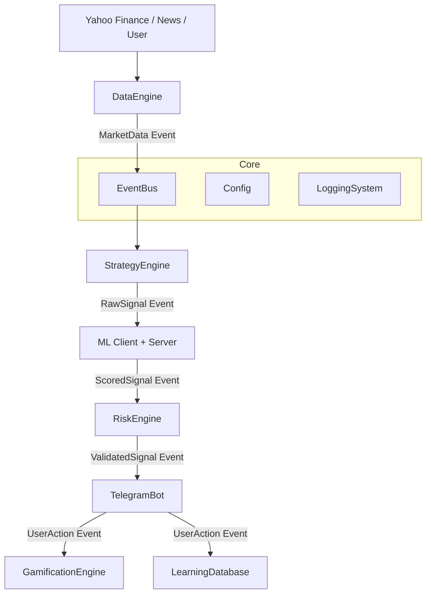

# Dokumentacja Architektury Systemu dla Audytu AI (OPISAI.MD)

Niniejszy dokument stanowi szczegółowy opis techniczny aplikacji "Trading Bot VPS Companion", przygotowany w celu umożliwienia przeprowadzenia audytu przez systemy sztucznej inteligencji lub audytorów technicznych. Dokument koncentruje się na architekturze, przepływie danych, zarządzaniu modelami oraz mechanizmach weryfikacji.

---

## 1. Wprowadzenie i Cel Aplikacji

### Cel Systemu
Głównym celem systemu jest **automatyzacja analizy rynków finansowych** oraz **wspomaganie decyzji inwestycyjnych użytkownika** w czasie rzeczywistym. System działa jako inteligentny asystent (Companion), który:
1.  Monitoruje tysiące instrumentów finansowych (Akcje, Forex, Krypto) w trybie 24/7.
2.  Filtruje szum rynkowy, identyfikując jedynie sygnały o wysokim prawdopodobieństwie sukcesu.
3.  Wykorzystuje modele Machine Learning do oceny jakości sygnałów ("Score").
4.  Dostarcza sformatowane rekomendacje bezpośrednio na komunikator Telegram.
5.  Gromadzi dane zwrotne od użytkownika w celu douczania modeli (Pętla sprzężenia zwrotnego).

### Grupa Docelowa
*   **Inwestorzy Indywidualni**: Użytkownicy końcowi podejmujący decyzje na podstawie sygnałów.
*   **Audytorzy Systemów AI**: Podmioty weryfikujące zgodność algorytmów z założeniami ryzyka.
*   **Developerzy AI/ML**: Osoby odpowiedzialne za trenowanie i wdrażanie modeli predykcyjnych.

---

## 2. Architektura Systemu

System oparty jest na **architekturze zdarzeniowej (Event-Driven Architecture)** z centralną szyną danych (`EventBus`). Pozwala to na luźne powiązanie modułów (decoupling) i asynchroniczne przetwarzanie dużych wolumenów danych.

### Diagram Wysokopoziomowy (Tekstowy)



### Kluczowe Technologie
*   **Język**: Python 3.9+ (Asyncio).
*   **Komunikacja**: Wewnętrzny `EventBus` (Pub/Sub).
*   **ML**: `scikit-learn` (Random Forest), `aiohttp` (komunikacja z serwerem ML).
*   **Dane**: `yfinance` (ceny), `ForexFactory` (kalendarz - scraping).
*   **Interfejs**: Telegram Bot API.

---

## 3. Szczegółowy Opis Modułów

### 3.1. Moduł Zarządzania Modelami (AI/ML)
*   **Kod źródłowy**: `app/ml/client.py`, `app/ml/server/` (zewnętrzny).
*   **Cel**: Ocena jakości sygnału wygenerowanego przez strategię techniczną. Model nie przewiduje ceny, lecz **prawdopodobieństwo akceptacji sygnału przez użytkownika** (Personalizacja) lub ogólną jakość techniczną.
*   **Główne Mechaniki**:
    *   Klient (`MlAdvisorClient`) wysyła wektor cech (RSI, MACD, Volatility, Time) do serwera ML.
    *   Serwer zwraca `ml_score` (0-100) oraz flagę `blacklisted` (czy instrument jest na czarnej liście ML).
    *   Obsługa trybu "Shadow Mode" (model ocenia w tle, ale nie blokuje sygnałów).
*   **Zależności**: Zewnętrzny serwer ML (REST API), pliki konfiguracyjne modeli (`.joblib`).
*   **Przechowywanie Danych**: `learning_database.json` (baza wiedzy do re-treningu).

### 3.2. Moduł Testów i Walidacji (Backtesting)
*   **Kod źródłowy**: `app/backtest_runner.py`, `app/instrument_stats_builder.py`.
*   **Cel**: Weryfikacja skuteczności strategii na danych historycznych przed ich użyciem w trybie Live.
*   **Główne Mechaniki**:
    *   Symulacja "świeca po świecy" na danych historycznych.
    *   Obliczanie metryk: Winrate, Risk:Reward Ratio, Max Drawdown, Profit Factor.
    *   Generowanie raportów skuteczności per instrument.
*   **Przechowywanie Danych**: Wyniki w `backtest_results/*.json`.

### 3.3. Moduł Raportowania i Interfejsu (Telegram)
*   **Kod źródłowy**: `app/telegram_bot/`, `app/analysis/briefing.py`.
*   **Cel**: Prezentacja wyników analizy w sposób zrozumiały dla człowieka oraz odbieranie komend sterujących.
*   **Główne Mechaniki**:
    *   Formatowanie wiadomości z użyciem Markdown (kolorowe statusy, emoji).
    *   Obsługa interaktywnych przycisków (Callback Query) do feedbacku (`✅`, `❌`) i zarządzania pozycjami (`Zamknij`).
    *   Generowanie porannych odpraw (`Briefing`) z podsumowaniem sentymentu rynkowego.
*   **Interfejsy**: Telegram Bot API (Webhook/Polling).

### 3.4. Moduł Logowania i Śledzenia (Audit Trail)
*   **Kod źródłowy**: `app/logging_system/`, `app/diagnostics.py`.
*   **Cel**: Zapewnienie pełnej identyfikowalności działań systemu (kto, co, kiedy) oraz monitorowanie stanu zdrowia aplikacji.
*   **Główne Mechaniki**:
    *   Logowanie strukturalne (JSON/Text) do plików rotowanych.
    *   Śledzenie pełnego cyklu życia sygnału: od pobrania ceny, przez decyzję ML, po wysłanie wiadomości.
    *   `TradeLogger`: Zapisywanie każdej zamkniętej transakcji do trwałej historii.
*   **Przechowywanie Danych**: `logs/app.log`, `logs/errors.log`, `app/data/trade_history.json`.

---

## 4. Przepływ Danych (Data Flow Pipeline)

Proces decyzyjny przebiega według ściśle określonej sekwencji ("Lejek Decyzyjny"):

1.  **Ingestia Danych**: `DataEngine` pobiera świece (OHLCV) z Yahoo Finance oraz dane makro z kalendarza.
2.  **Publikacja Zdarzenia**: Zdarzenie `MARKET_DATA` trafia na `EventBus`.
3.  **Analiza Strategiczna**: `StrategyEngine` subskrybuje dane. Jeśli wskaźniki (RSI, MACD, EMA) spełniają warunki -> generuje `RawSignal`.
4.  **Wzbogacanie ML**: `RawSignal` jest przechwytywany, a `MlAdvisorClient` odpytuje serwer ML o ocenę (`ml_score`).
5.  **Kontrola Ryzyka**: `RiskEngine` weryfikuje `ml_score` (np. musi być > 60%), sprawdza filtry newsowe ("High Impact") i wylicza wielkość pozycji (SL/TP).
6.  **Dystrybucja**: Jeśli wszystkie bramki są otwarte, zdarzenie `SIGNAL_READY` trafia do `TelegramBot`.
7.  **Interakcja**: Użytkownik podejmuje decyzję. Jego akcja (kliknięcie) generuje zdarzenie `USER_DECISION`, które aktualizuje `learning_database.json` (feedback dla ML).

---

## 5. Wymagania Niefunkcjonalne

*   **Wydajność**:
    *   Przetwarzanie pętli decyzyjnej dla jednego instrumentu < 100ms.
    *   Obsługa do 500 instrumentów w cyklu 5-minutowym (wymagana asynchroniczność I/O).
*   **Dostępność**:
    *   System zaprojektowany do pracy ciągłej (24/7) na serwerze VPS.
    *   Autorestart w przypadku awarii procesu (obsługa przez `systemd` lub Docker).
*   **Bezpieczeństwo**:
    *   Brak przechowywania wrażliwych danych użytkownika (tylko ID Telegrama).
    *   Tokeny API przechowywane w zmiennych środowiskowych (`.env`).
*   **Zgodność (Auditability)**:
    *   Każda decyzja systemu (również odrzucenie sygnału) musi być logowana z podaniem przyczyny (np. "Odrzucono: Zbyt niski ML Score").
    *   Możliwość odtworzenia decyzji na podstawie historycznych danych (Backtesting).

---

## 6. Podsumowanie, Opinia i Sugestie Weryfikacyjne

### Opinia o Architekturze
Proponowana architektura wykazuje wysoki poziom dojrzałości technicznej, szczególnie w aspekcie modularności i separacji odpowiedzialności (Event Bus).
*   **Mocne strony**:
    *   Zastosowanie asynchroniczności (`asyncio`) zapewnia skalowalność przy pobieraniu danych z wielu źródeł.
    *   Jasny podział na etapy decyzyjne ("Lejek") ułatwia debugowanie i audytowanie, dlaczego dany sygnał został lub nie został wygenerowany.
    *   Integracja pętli zwrotnej (Feedback Loop) pozwala na ciągłe doskonalenie modeli ML.
*   **Ryzyka**:
    *   Zależność od zewnętrznych dostawców danych (Yahoo Finance) bez wbudowanego mechanizmu failover na inne źródło.
    *   Potencjalne opóźnienia sieciowe w komunikacji z serwerem ML (jeśli nie jest lokalny).

### Sugestie do Weryfikacji (Checklista Audytora AI)
W celu pełnej walidacji systemu, zaleca się przeprowadzenie następujących testów:

1.  **Weryfikacja Modułu ML**:
    *   "Czy system poprawnie obsługuje niedostępność serwera ML (fallback do logiki sztywnej)?"
    *   "Czy model jest odporny na zjawisko 'data drift' (zmiany charakterystyki rynku w czasie)?"
2.  **Testy Wydajnościowe**:
    *   "Jak system zachowuje się przy nagłym skoku zmienności (duża liczba zdarzeń rynkowych jednocześnie)?"
    *   "Czy opóźnienie między pobraniem ceny a wysłaniem sygnału nie przekracza akceptowalnego progu (np. 2 sekundy)?"
3.  **Spójność Danych**:
    *   "Czy wyniki Backtestów pokrywają się z wynikami rzeczywistymi (Paper Trading)?"
    *   "Czy system poprawnie interpretuje podziały akcji (splits) i dywidendy w danych historycznych?"
4.  **Zgodność z Polityką Ryzyka**:
    *   "Przetestować scenariusz 'Czarnego Łabędzia' (nagły spadek o 20%) - czy Stop Lossy są respektowane bezwarunkowo?"

Dokument przygotowany dnia: 2026-01-28.
Wersja systemu: 2.0 (VPS Companion).

---

## 7. Rozszerzenia Klasy Instytucjonalnej (Institutional-Grade Extensions)

W celu podniesienia standardu systemu do poziomu 10/10, architektura została rozszerzona o 5 kluczowych warstw zapewniających bezpieczeństwo kapitału i transparentność decyzji.

### 7.1. Portfolio Context Layer (Kontekst Portfela)
*   **Moduł**: `app/portfolio/context.py`
*   **Cel**: Zapobieganie nadmiernej ekspozycji na skorelowane aktywa.
*   **Logika**: Przed otwarciem nowej pozycji, system sprawdza:
    *   Całkowitą ekspozycję walutową (np. max 3 pozycje z USD).
    *   Korelację z obecnymi pozycjami (np. nie kupuj EURUSD jeśli masz short GBPUSD).
    *   "Heatmap" ryzyka całego portfela.

### 7.2. Market Regime Detection Engine (Silnik Detekcji Reżimu Rynku)
*   **Moduł**: `app/analysis/market_regime.py`
*   **Cel**: Dynamiczne dostosowanie strategii do warunków rynkowych.
*   **Klasyfikacja**:
    *   **TRENDING**: Silny trend (ADX > 25). Strategia: Trend Follow (SL szerszy).
    *   **RANGING**: Konsolidacja (ADX < 20). Strategia: Mean Reversion (ciasny TP).
    *   **HIGH_VOLATILITY**: Wysoka zmienność (ATR > 2x średnia). Strategia: Ochrona kapitału (zmniejszenie pozycji o 50%).

### 7.3. Equity-Aware Risk Feedback Loop (Pętla Zwrotna Kapitału)
*   **Moduł**: `app/risk/equity_guard.py`
*   **Cel**: Ochrona przed serią strat (Drawdown Protection).
*   **Zasada**: Hard-stop dla tradingu po osiągnięciu dziennego limitu straty (np. -2% kapitału).
*   **Mechanizm**: `CircuitBreaker` blokuje otwieranie nowych pozycji do końca sesji (reset o 00:00 UTC).

### 7.4. Explainable ML Output (Wyjaśnialność ML)
*   **Moduł**: `app/ml/explainability.py`
*   **Cel**: Zrozumienie "dlaczego" model podjął decyzję (XAI).
*   **Implementacja**:
    *   Analiza wagi cech (Feature Importance) dla każdej predykcji.
    *   Komunikat dla użytkownika: "ML Score 85% (Główne czynniki: Wysoki RSI, Rosnący Wolumen)".

### 7.5. Explicit NO-TRADE Feedback (Jawny Feedback Odrzucenia)
*   **Implementacja**: `PortfolioManager` / `LearningDatabase`
*   **Cel**: Gromadzenie danych o "utraconych okazjach" i poprawnych odrzuceniach.
*   **Działanie**: System loguje nie tylko otwarte pozycje, ale także sygnały odrzucone przez filtry (np. "Odrzucono przez Reżim Rynku"). Pozwala to na trenowanie modeli na próbkach negatywnych (Negative Sampling).

---

## 8. Projekt Warstwy UI (Telegram Bot)

Zgodnie z wymogami "User-Friendly", interfejs Telegrama został podzielony na dwie odrębne strefy (Menu), aby oddzielić codzienne operacje użytkownika od zadań administracyjnych.

### 8.1. Koncepcja Dwóch Menu

1.  **MENU GŁÓWNE (User Menu):** Dostępne dla użytkownika na co dzień. Służy do sprawdzania stanu portfela, rynku i sygnałów. Jest w 100% bezpieczne (tylko odczyt lub bezpieczne przełączniki).
2.  **MENU SYSTEMOWE (Admin Menu):** Ukryte pod przyciskiem "⚙️ System". Służy do konfiguracji, restartów i diagnostyki. Wymaga świadomego działania.

### 8.2. Struktura Menu

#### A. Menu Główne (`/menu`)
*   **📊 Skaner Rynku:** Wyświetla podsumowanie aktywnych sygnałów i stanu rynku (Reżim).
*   **💼 Portfel:** Pokazuje otwarte pozycje, ekspozycję walutową i wynik sesji.
*   **🧠 Profil Tradera:** Statystyki gamifikacji (Level, XP) i postępy w nauce.
*   **📉 Status Ryzyka:** Bieżący Drawdown, wykorzystanie limitów dziennych.
*   **⚙️ System:** Przycisk przejścia do Menu Systemowego.

#### B. Menu Systemowe (Context / Admin)
*   **🖥️ Stan Serwera:** Uptime, zużycie RAM/CPU, status połączeń API.
*   **🛠️ Narzędzia:** Wymuś pobranie danych, Wyczyść cache, Test połączenia.
*   **⚠️ Tryb Awaryjny:** Przełącznik `PANIC BUTTON` (Zatrzymaj wszystko / Zamknij wszystko).
*   **🔙 Powrót:** Powrót do Menu Głównego.

### 8.3. Zasady Interakcji
*   **Minimalizm:** Brak konieczności wpisywania komend tekstowych. Wszystko obsługiwane przyciskami (Inline Keyboard).
*   **Bezpieczeństwo:** Akcje krytyczne (np. "Zamknij wszystko") wymagają dodatkowego potwierdzenia ("Czy na pewno? TAK/NIE").
*   **Feedback:** Każda akcja kończy się komunikatem zwrotnym (np. "✅ Cache wyczyszczony", "❌ Błąd połączenia").

### 8.4. Przykładowy Układ Przycisków (Keyboard Layout)

**Widok Główny:**
```
[ 📊 Skaner Rynku ] [ 💼 Portfel ]
[ 🧠 Profil Tradera ] [ 📉 Ryzyko ]
         [ ⚙️ System ]
```

**Widok Systemowy:**
```
[ 🖥️ Status ] [ 📝 Logi ]
[ 🔄 Restart ] [ ⚠️ PANIC ]
      [ 🔙 Powrót ]
```
